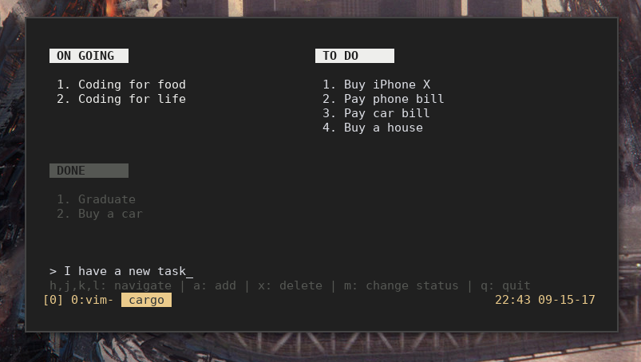

# trello-rs



A simple task manager (yeah, I know, it's not a trello clone) written in Rust.

Oh, and the text-based "screenshot":

```text

  ON GOING                               TO DO

  1. Coding for food                     1. Buy iPhone X
  2. Coding for life                     2. Pay phone bill
                                         3. Pay car bill
                                         4. Buy a house


  DONE

  1. Graduate
  2. Buy a car


 h,j,k,l: navigate | a: add | x: delete | m: change status | q: quit
```
